# Dormitory
宿舍管理系统网站开发(演示地址:www.runwsh.com)
角色: admin
账号：adminqwe
密码：adminqwe

# 高校宿舍管理系统  

## 系统概述  

本系统的主要功能为，楼栋管理员管理，宿舍管理，学生登记入住管理，学生迁出管理，学生寝室调换管理，学生缺勤记录管理，学生管理，学生上报维修，学生维修记录。  

## 功能介绍  

1 、楼栋管理员管理  
2 、宿舍管理  
3 、学生登记入住管理  
4 、学生迁出管理  
5 、学生迁出管理  
6 、学生缺勤记录管理  
7 、学生管理  
8 、学生管理  
9 、学生维修记录  

## 运行环境  

### 服务器端环境  

设备  | 设备指数  
 ---- | -----
 操作系统  | Windows 10
 数据库系统  | MySQL数据库
 可用内存  | 建议4096M以上
 
## 系统模块  

**首页展示:**  

  
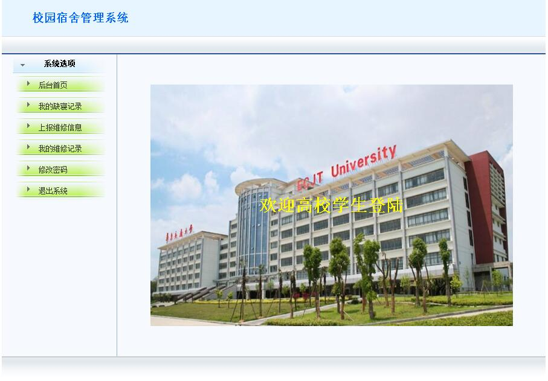  
  
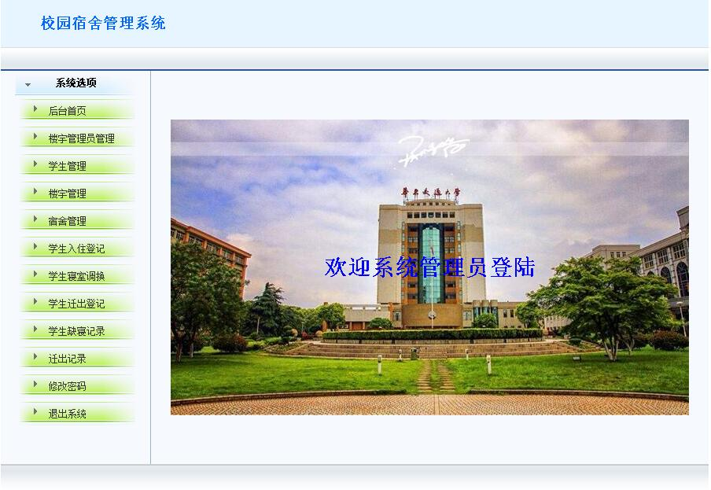  

##  系统管理员模块  

### 楼宇管理员管理  

**系统管理员可以在楼宇管理员界面对楼栋管理员进行增加及查询有的楼栋管理员**  
**对楼栋管理员进行删除及修改。其中查询可以根据楼栋管理管理员的姓名，电话，用户名进行查询。**  

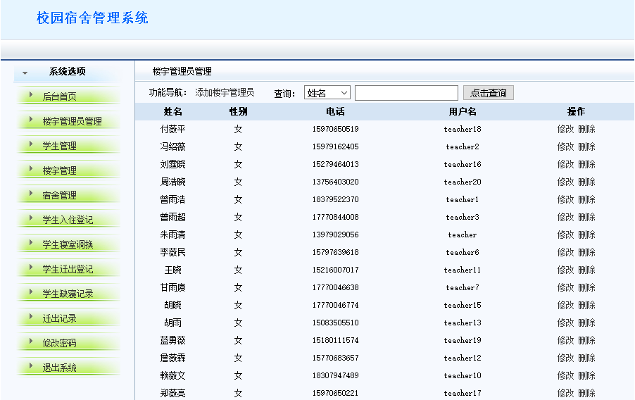  

**系统管理员可以点击添加楼栋管理员按钮跳转至添加楼栋管理员信息，添加完成后点击添加楼宇管理员按钮添加，如果不想添加可以点击返回上一页按钮返回楼栋管理页面。**  

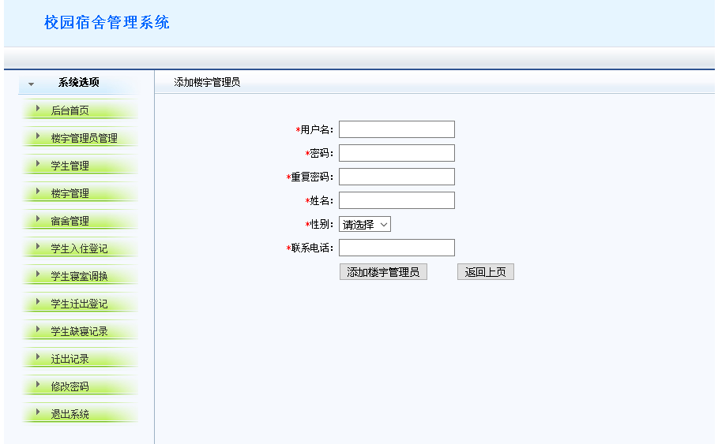  

## 楼宇管理  

**系统管理员可以在楼宇管理界面对楼宇进行增加及查询所有的楼宇，对楼宇进行删除及修改。其中查询可以根据楼宇名称进行查询。** 

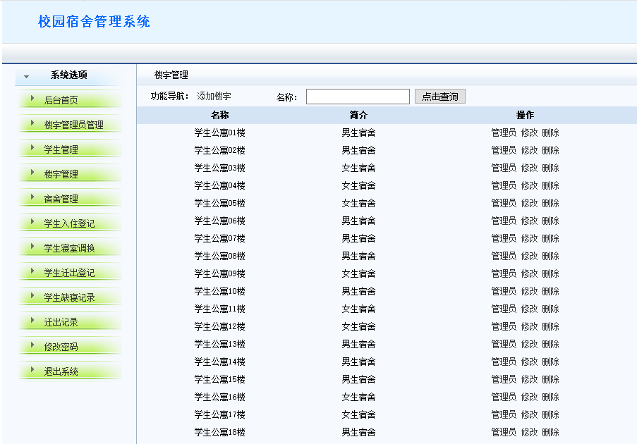  

**系统管理员可以点击添加楼宇按钮跳转至添加楼宇信息，添加完成后点击添加楼宇按钮添加，如果不想添加可以点击返回上一页按钮返回楼宇管理页面。**  
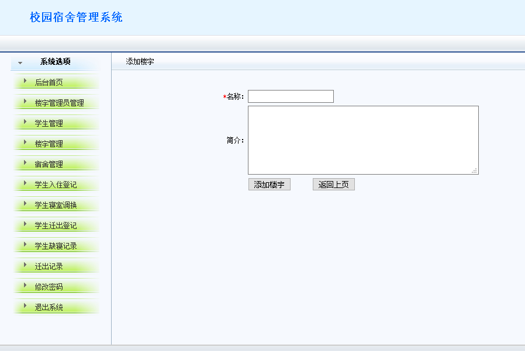  

## 宿舍模块  

**系统管理员可以在宿舍管理界面对宿舍进行增加及查询所有的宿舍信息，对宿舍信息进行删除及修改。其中查询可以根据楼宇号及寝室号，用户名，电话名进行查询。**  

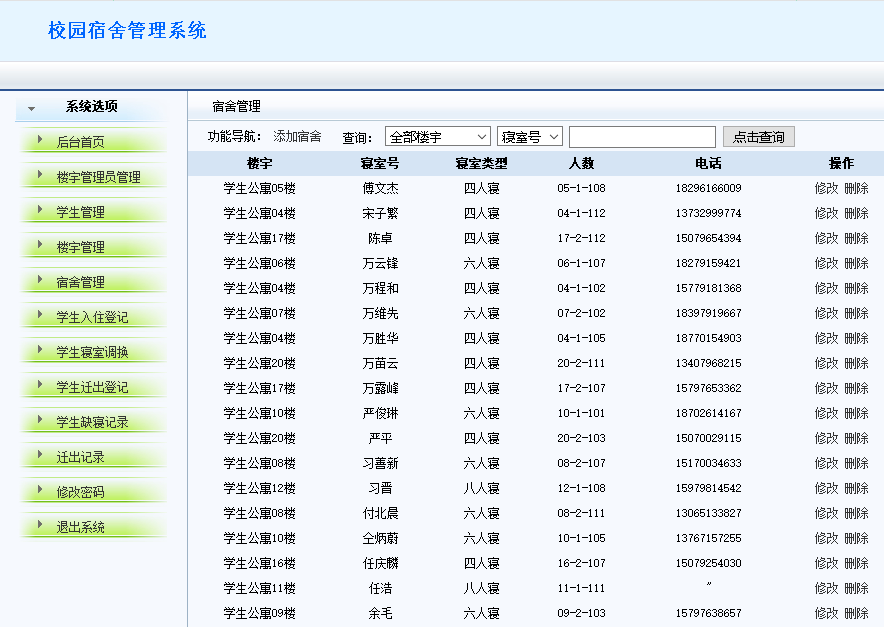  

## 学生登记入住模块  

**系统管理员可以在学生入住登记管理界面对田添加学生入住信息，点击确认入住提交数据。**  

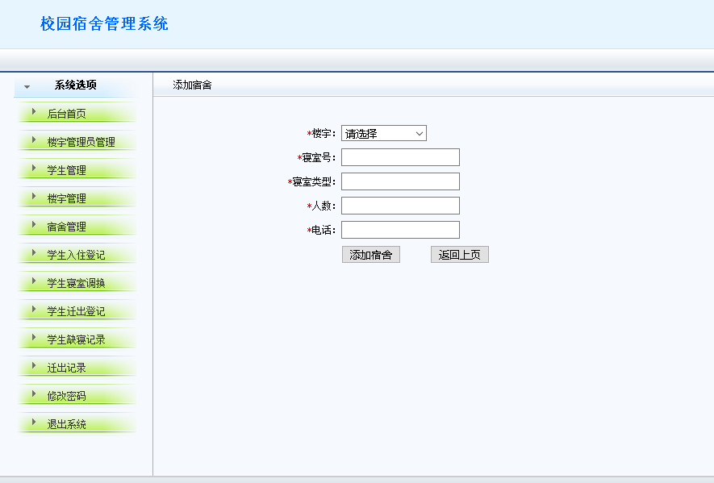  

## 学生迁出模块  

**学生离校时，系统管理员可以在学生迁出登记管理界面对田添加学生学号，点击确认入住提交数据将学生迁出。**  

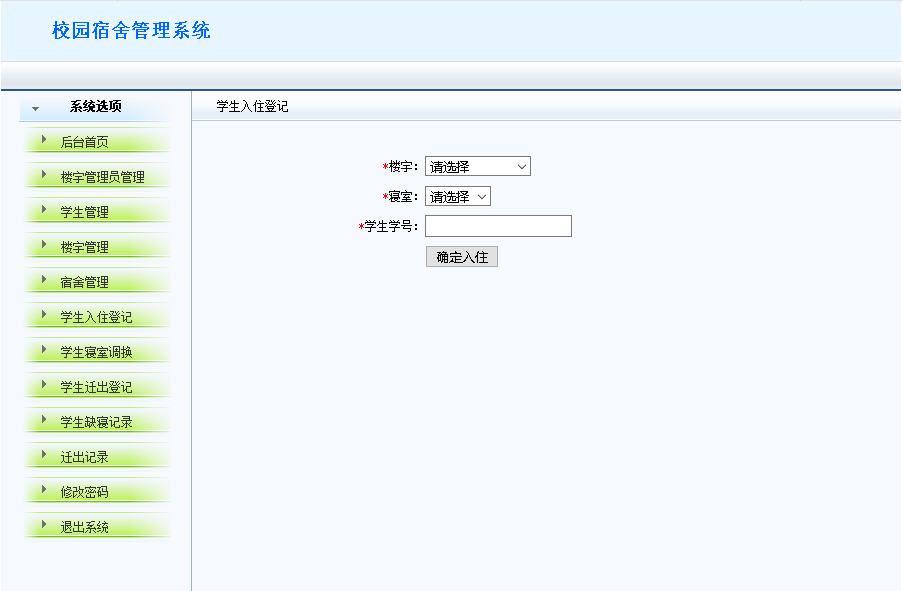  

## 学生寝室调换模块  

**学生换寝时，系统管理员可以在学生换寝管理界面对田添加学生学号，点击确认入住提交数据将学生迁出。**  

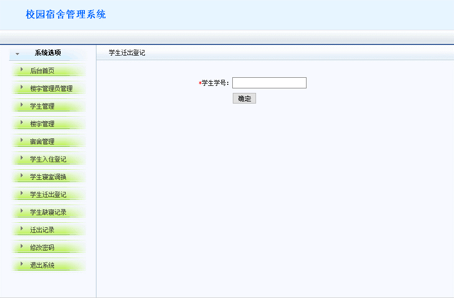 

## 学生缺勤记录模块  

**学生缺勤记录管理：记录学生未到寝室的学生上报系统。**  

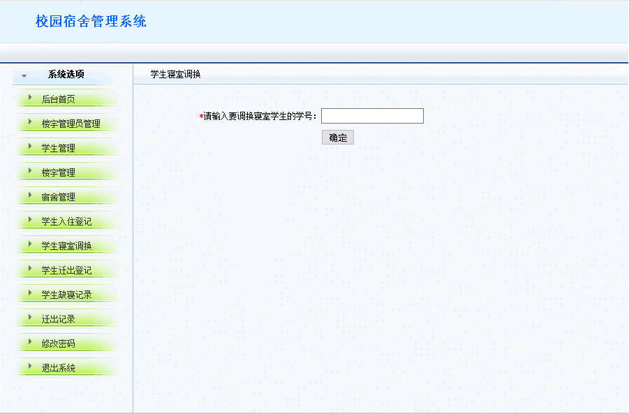  

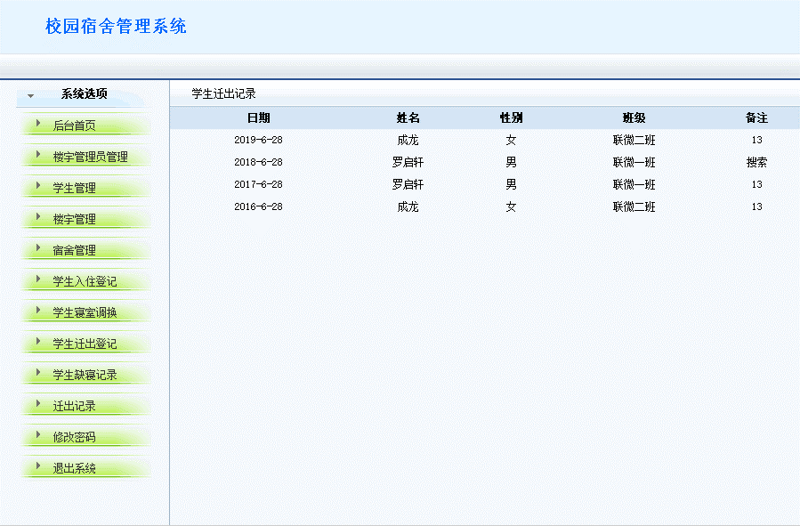  

## 宿舍管理员模块  

### 学生管理  

**可以按照姓名、学号来查询学生的信息**  

  

### 学生缺寝记录  

**学生可以查看自己的缺寝的情况记录**  

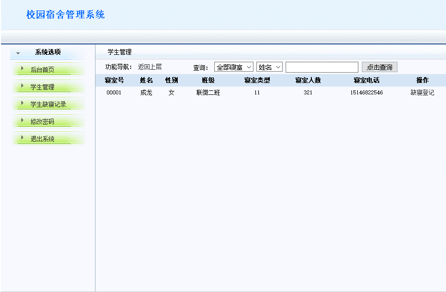  

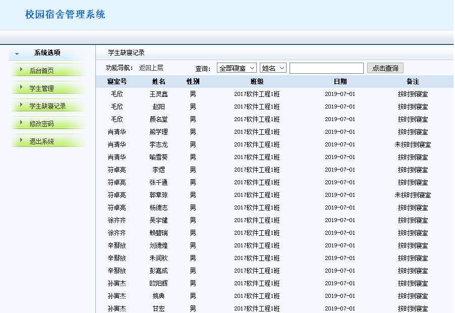  

## 学生模块  

### 学生上报维修  

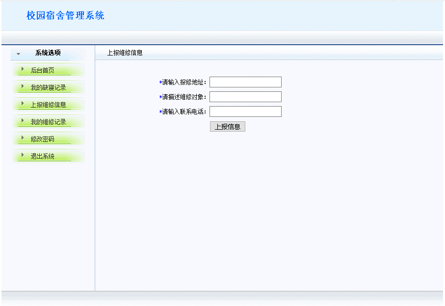  

### 学生维修记录模块  

**学生查看自己的维修信息**  

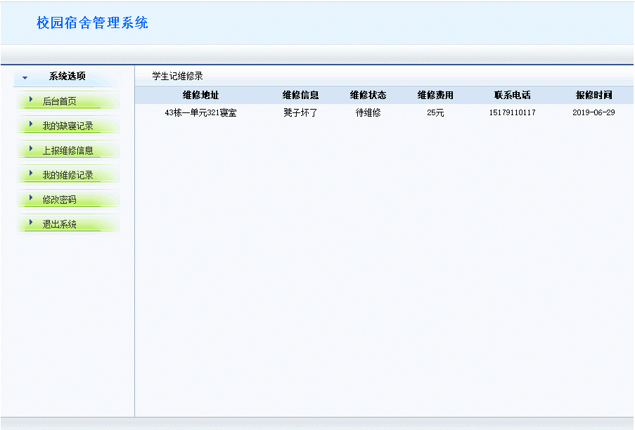  

# 项目问题和说明-公众号联系我【公众号里面回复：联系】

